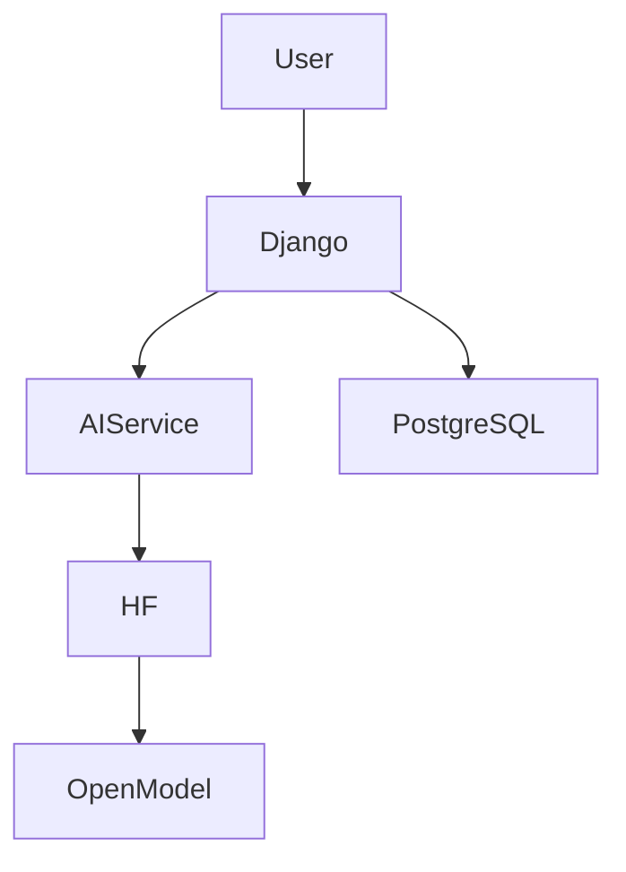

Live Demo - https://friendprep-ai.onrender.com/

# FriendPrep AI

## Problem
Many job candidates need more than a standard resume review; they need realistic practice with feedback, follow-up questions, and a clear action plan. FriendPrep AI addresses that by modeling a realistic interview coach for a specific friend preparing for a target role.

## Solution
FriendPrep AI combines a Django interview flow with a provider-abstracted open-weight AI layer. It captures the candidate profile, generates personalized questions, evaluates answers, and produces a final preparation report with recommendations.

## Features
- Personalized candidate setup
- AI-generated interview questions
- Answer evaluation with scoring and feedback
- Follow-up question generation
- Final report and topic recommendations
- Responsive Django template UI
- Render-ready production setup

## Tech Stack
- Python 3.12
- Django
- PostgreSQL / SQLite
- Hugging Face Inference Providers
- WhiteNoise
- Bootstrap 5

## Architecture


## Local Setup
1. Create and activate a virtual environment.
2. Install dependencies:
   ```bash
   pip install -r requirements.txt
   ```
3. Create a local .env file using .env.example as a guide.
4. Run database migrations:
   ```bash
   python manage.py migrate
   ```
5. Start the app:
   ```bash
   python manage.py runserver
   ```

## Environment Variables
The app reads values from a local .env file:
- SECRET_KEY
- DEBUG
- AI_PROVIDER
- HF_TOKEN
- AI_MODEL
- DATABASE_URL

Use .env.example as the base template.

## Running Locally
```bash
python manage.py migrate
python manage.py runserver
```

## AI Architecture
The AI layer is isolated behind an abstraction in the interview/ai package. This keeps the Django views independent from the model provider and allows swapping the open-weight model without rewriting the application logic.

## Deployment
The project includes a Render configuration and a build shell script for production deployment. Set the required environment variables in the Render dashboard and connect the managed PostgreSQL service.

## Open Innovation
This project intentionally uses an open-weight model via a hosted inference provider instead of a proprietary closed model. The service layer is provider-abstracted so the app can swap the model or provider with minimal changes. That makes the project more flexible, cost-aware, privacy-conscious, and aligned with open-source innovation principles.

## Screenshots
Placeholders can be added later after friend testing and final polishing.

## Future Improvements
- Voice-based interview flow
- Resume PDF parsing
- Model comparison mode
- Local inference options
- Multilingual interviews

## Hacktoberfest 2026
Built for the DEV Weekend Challenge: Build for a Friend.
